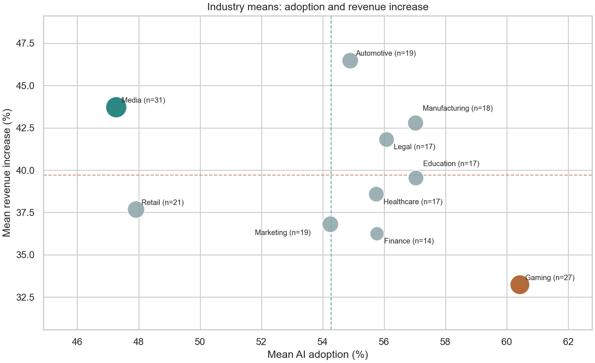

# Descriptive analysis of AI-related indicators in the Global AI Content Impact dataset

[Bản tiếng Việt](AI_impact_analysis_vi.md) · [Interactive dashboard](dashboard.html)

**Data:** [`Global_AI_Content_Impact_Dataset.csv`](../data/Global_AI_Content_Impact_Dataset.csv), 200 records covering 2020–2025. **Analysis date:** 9 October 2026. **CSV SHA-256:** `53b52d3d5fef30db9f575852ddcf6cbe347e049aef4de145f689f456fbf7a514`.

## Abstract

This report describes the distribution of AI-related measures and examines their linear associations within the available dataset. Across 200 records, the mean AI adoption rate is 54.27%. The variables labelled as revenue increase and job loss “due to AI” average 39.72% and 25.79%, respectively. The Pearson correlation between adoption and reported revenue increase is close to zero (r = 0.002; 95% confidence interval: −0.137 to 0.141). None of the 21 pairs of numeric measures meets a Benjamini–Hochberg adjusted threshold of q < 0.05. These findings describe the records in the CSV. The collection process, sampling design and operational definitions are undocumented, so the analysis does not estimate causal effects or population-wide rates.

## 1. Data and scope

The CSV has 12 columns: country, year, industry, seven numeric measures, and two categorical fields describing the most-used AI tool and regulation status. The numeric measures comprise six percentages — AI adoption, job loss, revenue increase, human–AI collaboration, consumer trust and AI company market share — plus annual AI-generated content volume in terabytes. The records span 10 countries, 10 industries and the six years from 2020 through 2025.

There are no missing cells or fully duplicated rows. All percentage values fall between 0 and 100, and content volumes are positive. However, **28 records repeat a country–year–industry combination** already present in the file; one combination occurs as many as four times. No observation identifier is supplied. The repeated combinations cannot therefore be classified as independent observations or recording errors. All 200 rows are retained.

The repository does not identify the data collector, sampling procedure, formulas behind the measures, or the rule used to attribute revenue changes and job losses to AI. Column names identify intended constructs but do not establish how they were measured. Consequently, the reported averages are **record-level sample means**, not rates for entire countries, industries or the global market.

## 2. Methods

Descriptive statistics include the mean, median and sample standard deviation. Records receive equal weight because no sampling weights are available. Annual means are not adjusted for changes in the country or industry mix. Simple linear regressions of each outcome on year describe slopes within this sample. The 95% intervals around annual means use the t distribution.

Pearson's r describes associations among the seven numeric measures; year is excluded from this correlation matrix. The seven measures yield 21 pairs. Confidence intervals for r use Fisher's transformation, and p-values across the 21 pairs are adjusted using the Benjamini–Hochberg procedure. These intervals and tests depend on statistical assumptions about independent observations and sampling. The available documentation does not establish those assumptions. They are reported to convey uncertainty under the stated model, not to justify generalization beyond the sample.

## 3. Results

### 3.1. Distribution of the main measures


*Figure 1. Distributions of three reported percentages; vertical lines mark sample means. Source: repository CSV, 2020–2025, n = 200.*

AI adoption has a mean of 54.27%, a median of 53.31% and a sample standard deviation of 24.22 percentage points. The corresponding values for reported revenue increase are 39.72%, 42.10% and 23.83 percentage points; for reported job loss they are 25.79%, 25.74% and 13.90 percentage points. This dispersion matters when interpreting any single average.

### 3.2. Differences across years


*Figure 2. Annual means with t-based 95% intervals. Sample sizes from 2020 to 2025 are 47, 32, 31, 29, 23 and 38 records, respectively. Source: repository CSV.*

Mean AI adoption is 50.99% in 2020, reaches 59.68% in 2023 and is 54.26% in 2025. A simple regression on year yields a slope of 0.33 percentage points per year (p = 0.725). For reported revenue increase, the slope is −1.14 percentage points per year (p = 0.221). Both series fluctuate. Yearly sample sizes and composition differ, and the data do not establish that the same units were followed over time.

### 3.3. Associations among measures


*Figure 3. Pearson correlations among seven numeric measures, n = 200. The 21 unique pairs use a −0.25 to 0.25 color scale to reveal small coefficients; color does not indicate statistical significance. Source: repository CSV.*


*Figure 4. Each point represents one record; the line is a descriptive linear fit. Source: repository CSV, n = 200.*

The correlation between AI adoption and reported revenue increase is r = 0.002 (p = 0.979; 95% confidence interval: −0.137 to 0.141). Adoption and reported job loss have r = −0.005 (p = 0.949). Of the 21 pairs, the largest absolute correlation is between job loss and revenue increase (r = 0.153; unadjusted p = 0.031). Its adjusted value is q = 0.644, and no pair reaches q < 0.05. These data show no clear linear association of substantial magnitude among the main measures. They do not establish that any real-world effect is zero.

### 3.4. An industry comparison



*Figure 5. Each point is an industry mean, sized by record count; dashed lines mark full-sample means. Source: repository CSV, n = 200.*

Among the 10 industries, Gaming has the highest mean AI adoption (60.42%; n = 27) but the lowest reported revenue increase (33.23%). Media has the lowest mean adoption (47.26%; n = 31), while its reported revenue increase is 43.72%. This reversal in ranks warrants closer examination but offers no explanation for the difference. Industry means are unadjusted for country, year or characteristics of the observation unit, and no formal test of the Gaming–Media difference is made here.

## 4. Interpretation and limitations

“Due to AI” is a label supplied in the CSV. The dataset lacks a comparison group, before-and-after measurements for identified units, and documented confounders needed to assess attribution. The coefficients in this report therefore describe relationships among recorded variables.

The absence of a sampling design and weights also limits generalization. Record counts vary by year, country and industry, while the 28 repeated country–year–industry combinations leave the independence of observations unresolved. Confidence intervals and p-values should be read conditional on the assumptions described in Section 2. Failure to cross a testing threshold is not evidence that AI has no effect.

Before using the data to inform a decision, obtain documentation of the observation unit, collection source, formula and timing of each measure, treatment of repeated records, and data-use rights. An impact study would also require measurements for comparable units over time and an appropriate comparison design.

## 5. Reproducibility

From the repository root:

```bash
python -m pip install -r requirements.txt
python analyze_data.py
python build_dashboard.py
```

The first script writes five figures in English, five corresponding figures in Vietnamese, and [`summary.json`](figures/summary.json) to `reports/figures/`. The second embeds the CSV and all ten images in the offline [HTML dashboard](dashboard.html). Run `analyze_data.py` before `build_dashboard.py`; the builder checks the CSV SHA-256 to avoid embedding figures from another data version. The fixed narrative in the HTML describes the current 200 records and should be reviewed if the source changes. `analyze_data.py` accepts `--data` and `--output` to select another source or destination. Older PNG files in the repository root were produced by earlier code and are not used in this report.
