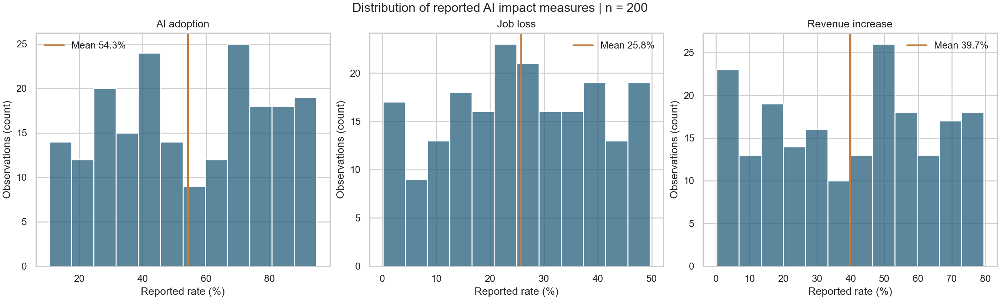
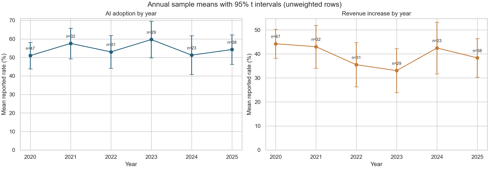
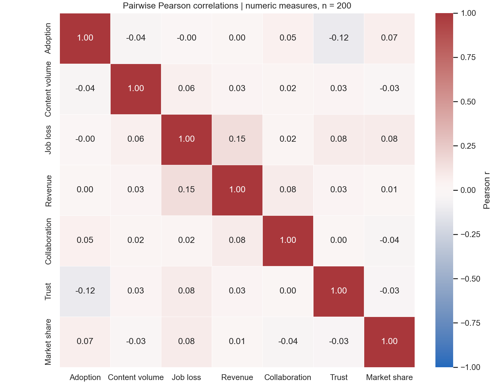
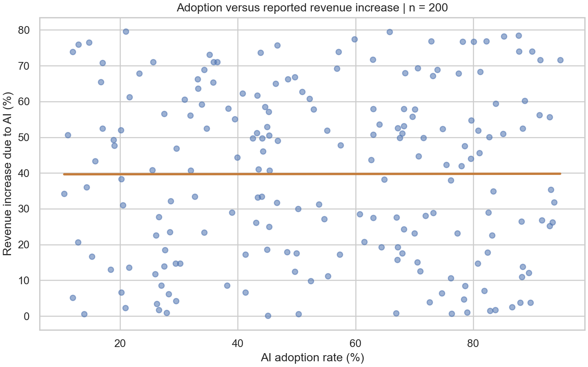

# Báo cáo phân tích bộ dữ liệu Global AI Content Impact

**Phạm vi:** 200 bản ghi thuộc 10 quốc gia, 10 ngành và các năm 2020–2025.

**Nguồn:** [`data/Global_AI_Content_Impact_Dataset.csv`](../data/Global_AI_Content_Impact_Dataset.csv), SHA-256 `53b52d3d5fef30db9f575852ddcf6cbe347e049aef4de145f689f456fbf7a514`.

**Ngày phân tích:** 09/10/2026. Mọi kết quả được tính từ bản CSV trong repo.

## Tóm tắt điều hành

Bộ dữ liệu ghi nhận tỷ lệ ứng dụng AI trung bình **54,27%**, tăng doanh thu được gán cho AI trung bình **39,72%**, và mất việc được gán cho AI trung bình **25,79%**. Đây là **trung bình của các dòng dữ liệu**, không phải tỷ lệ toàn cầu hay ước lượng đại diện cho dân số.

Trong mẫu này, tỷ lệ ứng dụng AI gần như không có liên hệ tuyến tính với mức tăng doanh thu được báo cáo: **Pearson r = 0,002**, khoảng tin cậy 95% **[-0,137; 0,141]**, p = **0,979**. Liên hệ với tỷ lệ mất việc cũng gần 0 (**r = -0,005**). Trong 21 cặp chỉ số định lượng được xem xét, tương quan mạnh nhất theo trị tuyệt đối là giữa mất việc và tăng doanh thu (**r = 0,153**), nhưng không đạt ngưỡng 5% sau hiệu chỉnh Benjamini–Hochberg (**q = 0,644**).

**Khuyến nghị:** dùng bộ dữ liệu này cho minh họa quy trình phân tích khám phá; chưa dùng các con số để kết luận AI gây tăng doanh thu, mất việc, hay để so sánh hiệu quả chính sách giữa quốc gia/ngành. Muốn hỗ trợ quyết định thực tế cần xác nhận nguồn, định nghĩa chỉ số, đơn vị quan sát, cách lấy mẫu và phương pháp đo.

## 1. Câu hỏi và cách tiếp cận

Phân tích trả lời ba câu hỏi: mức độ phân bố của các chỉ số là gì; các trung bình theo năm biến động ra sao; và những chỉ số định lượng có quan hệ tuyến tính rõ ràng hay không. Mã tại [`analyze_data.py`](../analyze_data.py) đọc CSV, kiểm tra cấu trúc, tính số liệu, lưu [`summary.json`](figures/summary.json) và tạo bốn biểu đồ có thể chạy lại.

Mỗi dòng được giữ với trọng số bằng nhau vì CSV không cung cấp trọng số mẫu. Trung bình theo năm không điều chỉnh thành phần quốc gia/ngành. Pearson r đo quan hệ tuyến tính; khoảng tin cậy dùng biến đổi Fisher. Giá trị p của 21 cặp chỉ số được hiệu chỉnh Benjamini–Hochberg để hạn chế phát hiện giả khi xem nhiều cặp. Khoảng 95% quanh trung bình năm dùng phân phối t và độ lệch chuẩn mẫu; các khoảng này chỉ có ý nghĩa suy luận nếu giả định về lấy mẫu phù hợp.

## 2. Kiểm tra dữ liệu

- **Kích thước:** 200 dòng, 12 cột; 6 năm từ 2020 đến 2025; 10 quốc gia; 10 ngành.
- **Độ đầy đủ:** 0 ô trống; 0 dòng trùng hoàn toàn.
- **Đơn vị quan sát:** không được mô tả. Có **28 dòng lặp tổ hợp Country–Year–Industry**, tối đa 4 dòng cho một tổ hợp. Không thể xem tổ hợp đó là khóa duy nhất hoặc tự ý gộp/lọc các dòng lặp.
- **Kiểm tra miền:** các cột phần trăm trong CSV đều nằm trong khoảng 0–100; cột khối lượng nội dung có giá trị dương.
- **Xuất xứ:** repo không có tài liệu về tổ chức thu thập, phương pháp lấy mẫu, định nghĩa chỉ số, cách quy trách nhiệm “Due to AI”, hoặc giấy phép dữ liệu. Vì thế chưa thể xác minh tính đại diện và độ tin cậy của số đo.

Các cột gồm Country, Year, Industry, sáu tỷ lệ phần trăm (ứng dụng AI, mất việc, tăng doanh thu, hợp tác người–AI, niềm tin người tiêu dùng, thị phần công ty AI), khối lượng nội dung do AI tạo (TB/năm), Top AI Tools Used, và Regulation Status. Tên cột mô tả ý định đo lường, nhưng không thay thế định nghĩa vận hành của chỉ số.

## 3. Kết quả mô tả



*Hình 1. Số dòng theo tỷ lệ được báo cáo; đường đứng là trung bình mẫu. Nguồn: CSV trong repo, 2020–2025, n = 200.*

Ứng dụng AI có trung vị **53,31%** và độ lệch chuẩn **24,22 điểm phần trăm**; mức tăng doanh thu có trung vị **42,10%**, độ lệch chuẩn **23,83**; tỷ lệ mất việc có trung vị **25,74%**, độ lệch chuẩn **13,90**. Biên độ lớn cho thấy trung bình riêng lẻ che khuất khác biệt giữa các dòng.



*Hình 2. Trung bình mẫu theo năm và khoảng 95% tính bằng phân phối t. Số dòng mỗi năm: 2020 = 47, 2021 = 32, 2022 = 31, 2023 = 29, 2024 = 23, 2025 = 38. Nguồn: CSV trong repo.*

Trung bình ứng dụng AI dao động từ **50,99% (2020)** đến **59,68% (2023)**, rồi là **54,26% (2025)**. Hồi quy tuyến tính ở cấp dòng theo Year cho độ dốc **+0,33 điểm phần trăm/năm**, p = **0,725**. Doanh thu tăng được báo cáo có độ dốc **-1,14 điểm phần trăm/năm**, p = **0,221**. Đây không phải bằng chứng về xu hướng tăng hoặc giảm bền vững; mẫu mỗi năm khác nhau và không có thiết kế theo dõi cùng đơn vị qua thời gian.

## 4. Quan hệ giữa các chỉ số



*Hình 3. Pearson r giữa bảy chỉ số định lượng, không đưa Year vào như một thước đo tác động. Nguồn: CSV trong repo, n = 200.*



*Hình 4. Mỗi điểm là một dòng; đường là hồi quy tuyến tính mô tả, không mang nghĩa nhân quả. Nguồn: CSV trong repo, n = 200.*

Các hệ số tương quan quan sát được đều có độ lớn nhỏ; **|r| lớn nhất là 0,153**. Chỉ cặp mất việc–tăng doanh thu có p chưa hiệu chỉnh dưới 0,05 (**0,031**), nhưng q sau hiệu chỉnh là **0,644**. Với ứng dụng AI–tăng doanh thu, khoảng tin cậy vẫn cho phép các liên hệ âm/dương nhỏ; dữ liệu không chứng minh “không có tác động”, chỉ cho thấy **không phát hiện quan hệ tuyến tính rõ trong mẫu này**.

## 5. Giới hạn và hàm ý sử dụng

1. **Không có cơ sở quy nhân quả.** Dữ liệu quan sát không có nhóm đối chứng, thời điểm trước/sau, hay biến kiểm soát được xác minh. Các nhãn “Due to AI” trong CSV là tên cột, không phải bằng chứng về nguyên nhân.
2. **Không rõ mức độ đại diện.** Quốc gia, ngành và năm có số dòng khác nhau; không có trọng số hoặc thiết kế chọn mẫu. Không ngoại suy trung bình mẫu thành “toàn cầu”.
3. **Khóa dữ liệu chưa rõ.** Lặp Country–Year–Industry có thể là nhiều đơn vị hợp lệ hoặc lỗi ghi nhận. Cần data dictionary/ID quan sát trước khi gộp hoặc loại.
4. **Sai số đo chưa biết.** Không có công thức cho adoption, job loss, revenue increase, collaboration, trust, market share và content volume; cũng không rõ nguồn của “Top AI Tools Used” và “Regulation Status”.
5. **Biểu đồ suy luận phụ thuộc giả định.** Các khoảng tin cậy và p-value được trình bày để minh họa độ bất định dưới giả định thống kê thông thường, không khắc phục thiếu sót của nguồn dữ liệu.

### Bước tiếp theo nếu dùng cho quyết định

Thu thập metadata gốc và ID đơn vị quan sát; xác minh thang đo, phương pháp lấy mẫu và quyền sử dụng; chuẩn hóa khóa; thiết kế phân tích theo cùng đơn vị qua thời gian, có biến kiểm soát và thước đo kết quả xác thực. Sau đó mới cân nhắc so sánh theo ngành/quốc gia hoặc đánh giá tác động.

## 6. Tái tạo kết quả

Tại thư mục gốc repo:

```bash
python -m pip install -r requirements.txt
python analyze_data.py
```

Đầu ra nằm trong `reports/figures/`. Có thể thay dữ liệu/đích bằng `--data path/to/file.csv --output path/to/dir`. Script báo lỗi khi thiếu cột bắt buộc hoặc dữ liệu rỗng; kết quả số đầy đủ và p/q được ghi trong `summary.json`. Các PNG cũ ở thư mục gốc thuộc script trước đây và không phải nguồn cho báo cáo này.
